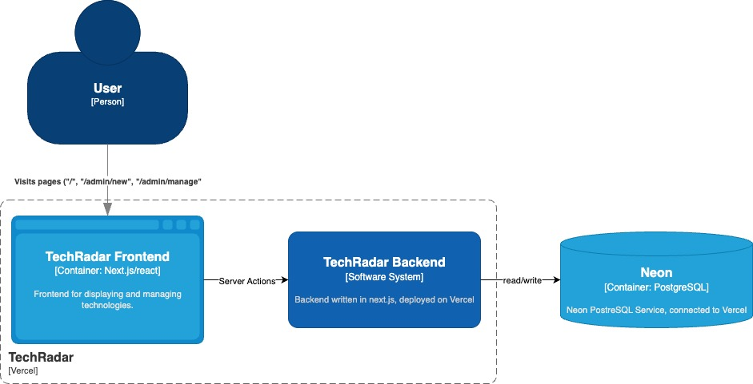
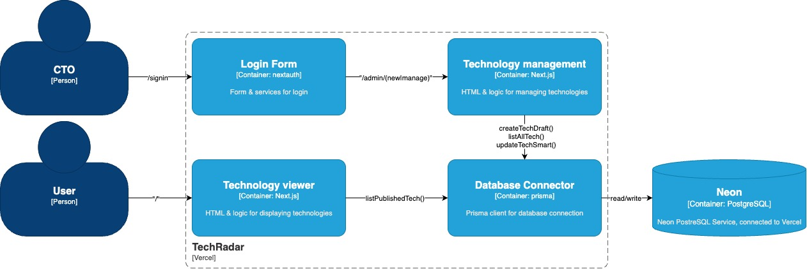

# WEBLAB - TechRadar Dokumentation

---

# 1. Einführung und Ziele

## 1.1 Aufgabenstellung
Eine **Technology-Radar** Webanwendung mit zwei Teilen:
- **Administration:** CTO oder Tech-Lead verwalten Technologien (erfassen, ändern, einordnen, publizieren).
- **Viewer:** Mitarbeitende sehen **nur publizierte** Technologien (ohne Login).

## 1.2 Qualitätsziele
1) **Sicherheit:** Nur **CTO/Tech-Lead** dürfen die Administration nutzen (Viewer ohne Login).  
2) **Benutzbarkeit:** Schlanke Admin-Workflows, klare Validierungen; responsive UI (Desktop/Mobile/Tablet).  
3) **Datenkonsistenz:** Muss-Felder, Zustände **Draft/Published**, Timestamps (`createdAt`, `publishedAt`, `updatedAt`).  
4) **Nachvollziehbarkeit:** **Admin-Login-Audit** vorgesehen. ⚠️ GAP (aus Zeitgründen nicht umgesetzt)  
5) **Performance:** Viewer lädt in **≤ 1 s** bei **Fast-4G**.  
6) **Wartbarkeit/Qualität:** Unit/Integration-Tests (Vitest/Jest), E2E (Playwright).

## 1.3 Stakeholder
| Rolle           | Erwartung |
|-----------------|-----------|
| CTO / Tech-Lead | Sichere Admin-Anmeldung, Verwaltung von Technologien. |
| Mitarbeitende   | Schnelle, übersichtliche Anzeige publizierter Technologien (ohne Login). |
| Plattform/Infra | Betrieb auf **Vercel** und **Neon Postgres**, keine persistenten Files. |

---

# 2. Randbedingungen

## 2.1 Technische Randbedingungen
- **Hosting/Deploy:** **Vercel** (Serverless, keine persistenten Logfiles).  
- **Datenbank:** **Neon Postgres**; ORM: **Prisma**.  
- **Frameworks:** **Next.js** (Server Actions/Routes), **NextAuth (Credentials)** mit im Code hinterlegten **bcrypt-Hashes**.  
- **Audit/Logging:** Admin-Logins sollen auditiert werden → auf Vercel via **DB-Tabelle** oder **Log-Drain** zu externem Service. ⚠️ GAP (aus Zeitgründen nicht umgesetzt)  
- **Tests:** **Vitest/Jest** (Unit/Integration), **Playwright** (E2E).  
- **Zielgeräte:** Responsive Desktop/Mobile/Tablet.

## 2.2 Organisatorische Randbedingungen
- **Rollen:** Nur **CTO** und **Tech-Lead** erhalten Admin-Zugriff.  
- **Publikation:** Nur über die Administration; Draft/Published-Schritte sind Pflicht.

## 2.3 Standards/Tools
- **Dokumentation:** arc42; Architekturentscheidungen als **MADR** (Markdown-ADRs).  
- **CI/CD:** Vercel (Preview/Prod); Env-Variablen für Secrets/DB-Zugriff.

---

# 3. Kontextabgrenzung

## 3.1 Fachlicher Kontext
- **Akteure:**  
  - **CTO/Tech-Lead:** Admin-Anmeldung, Technologien verwalten/publizieren.  
  - **Mitarbeitende:** Sehen publizierte Technologien (Viewer, ohne Login).

## 3.2 Technischer Kontext
- **Client:** Browser (Desktop/Mobile/Tablet).  
- **Web-App:** Next.js mit Middleware-Schutz für `/admin/*`.  
- **Auth:** NextAuth Credentials, bcrypt-Hashes im Code.  
- **DB:** Prisma ↔ Neon Postgres.  
- **Audit:** Geplant (DB-Audit oder Log-Drain). ⚠️ GAP

## 3.3 Mapping fachlich ↔ technisch
| Use Case                         | Technische Umsetzung |
|----------------------------------|----------------------|
| Admin anmelden                   | NextAuth Credentials, Middleware prüft Rolle (CTO/Tech-Lead). |
| Erfassen/Ändern/Publizieren      | Admin-UI → Server Actions → Prisma → Postgres. |
| Viewer ansehen (ohne Login)      | `GET /` → nur publizierte Einträge. |

---

# 4. Lösungsstrategie

- **Architekturstil:** Next.js-App mit klar getrenntem **Admin** und **Viewer**; serverseitige Mutationen (Server Actions).  
- **Sicherheit:** Middleware-Gate auf `/admin/*`; zugelassen nur CTO/Tech-Lead (via Credentials & Rollen).  
- **Persistenz:** Prisma-Schema mit `createdAt`, `updatedAt`, `publishedAt`, `status` (Draft/Published).  
- **Performance:** Sparsame Queries; nur publizierte Daten im Viewer; Revalidation/ISR gemäß Next.js-Defaults.  
- **Tests:** Vitest/Jest (Unit/Integration) + Playwright (E2E) auf Kern-Flows.  
- **Audit:** Admin-Login-Audit einplanen (DB oder Drain). ⚠️ GAP (aus Zeitgründen nicht umgesetzt)

---

# 5. Bausteinsicht

## 5.1 Whitebox Gesamtsystem
**Bausteine (Blackboxes)**
- **Viewer (Public):** Listet **nur publizierte** Technologien (sortiert).  
- **Admin-UI:** Neue Technologien erfassen, publizieren und anpassen.  
- **Auth-Modul:** NextAuth Credentials; Rollenprüfung (CTO/Tech-Lead).  
- **Domain-Services:** Validierung, Statuswechsel, Timestamps setzen.  
- **Persistenz:** Prisma-Client, Migrations; Neon Postgres.

**Wichtige Schnittstellen**
- HTTP(S)-Routes/Server Actions; Prisma-DB-Zugriff; NextAuth-Routes.

## 5.2 Ebene 2 (Auszug)
- **Admin-UI:** Formulare (Erfassen/Ändern/Publish), Validierungslogik.  
- **Viewer:** Listen-Darstellung (Sortierung). 
- **Services:** `createTechDraft`, `listAllTech`, `updateTechSmart`, `listPublishedTech`.  

---

# 6. Laufzeitsicht

## 6.1 „Admin meldet sich an“ (US1)
1. CTO/Tech-Lead übergibt Credentials.  
2. NextAuth verifiziert (bcrypt-Hash).  
3. Middleware gewährt Zugriff auf `/admin/*`.  
4. **Audit-Write** (Login-Event). ⚠️ GAP

## 6.2 „Technologie erfassen“ (US2)
1. Admin füllt Muss-Felder (Name, Kategorie, Ring, Beschreibungen) aus.  
2. Server Action validiert; `createdAt` wird gesetzt (Prisma).  
3. Bei Fehlern: keine Speicherung, klare Meldung.

## 6.3 „Entwurf publizieren“ (US3)
1. Entwurf (Draft) ist markiert.  
2. Auswahl „Publizieren“ → Pflicht: **Ring** + **Einordnung**.  
3. Server Action setzt `status=Published`, `publishedAt`.  
4. Viewer zeigt den Eintrag nach Reload (öffentlich).

## 6.4 „Technologie ändern“ (US4/US5)
1. Admin ändert Name/Kategorie/Beschreibung **oder** Ring/Einordnung.  
2. Server Action speichert; `updatedAt` automatisch.  
3. Bestätigung/Fehlermeldung.

## 6.5 „Viewer ruft Startseite auf“ (US6)
1. Client ruft `/`.  
2. Server liefert **nur publizierte** Einträge (sortiert).  
3. Ladeziel: **≤ 1 s** bei Fast-4G.

---

# 7. Verteilungssicht

## 7.1 Infrastruktur – Ebene 1
- **Vercel**: Next.js (Serverless Functions/Edge), ISR/Revalidate; Logs über Console/Function Logs.  
- **Neon Postgres**: Datenhaltung (Produktions-Branch).  
- **Client**: Browser (Desktop/Mobile/Tablet).

**Zuordnung**
- Web-App → Vercel  
- DB → Neon Postgres  

## 7.2 Infrastruktur – Ebene 2
- **Env-Variablen:** `DATABASE_URL`, `NEXTAUTH_SECRET`, Credentials-Hashes/Salt (nicht im Repo).

---

# 8. Querschnittliche Konzepte

## 8.1 Sicherheit
- Middleware schützt `/admin/*`; Rollen: **CTO/Tech-Lead** (keine Viewer-Anmeldung).  
- Credentials: bcrypt-Hashes im Code (Testzwecke).

## 8.2 Persistenz & Schema
- **Prisma** mit Feldern: `id`, `name`, `category`, `ring`, `techDescription`, `classificationDescription`, `status` (Draft/Published), `createdAt`, `updatedAt`, `publishedAt`.

## 8.3 Validierung & Fehler
- Muss-Felder erzwungen (US2/US3); konsistente Fehlermeldungen; HTTP-Status/Toasts (Projektstil).

## 8.4 Logging/Audit
- **Admin-Login-Audit** bei Login-Versuchen (username, timestamp, outcome). ⚠️ GAP 

## 8.5 Tests
- **Vitest/Jest** (Unit/Integration) für Services/Validierungen.  
- **Playwright** (E2E): Login, Erfassen, Publish, Viewer-Sicht.

## 8.6 Caching/Delivery
- Nutzung der **Next.js-Defaults** (ISR/Revalidation). Keine zusätzlichen Reverse-Proxies.

---

# 9. Architekturentscheidungen (MADR)

- **ADR-001: Hosting auf Vercel** – *Accepted*  
  *Konsequenz:* Keine persistenten Logfiles → Audit via DB/Drain.

- **ADR-002: Neon Postgres + Prisma** – *Accepted*  
  *Konsequenz:* Migrationsfluss mit Prisma; Preview-Branches möglich aber nicht eingesetzt.

- **ADR-003: Auth via NextAuth (Credentials, bcrypt)** – *Accepted (Interim)*  
  *Konsequenz:* Rollen nur CTO/Tech-Lead; Secrets hardcoded; später IdP/2FA optional.

- **ADR-004: Admin-Login-Audit** – *Proposed* ⚠️  
  *Konsequenz:* Kleine Mehrarbeit; klare Retention/DSG-Regeln nötig.

---

# 10. Qualitätsanforderungen

## 10.1 Qualitätsbaum (Auszug)
- **Performance:** Viewer **≤ 1 s** (Fast-4G).  
- **Security:** Admin-Bereich nur CTO/Tech-Lead.  
- **Auditability:** Admin-Logins auditiert. ⚠️ GAP  
- **Usability:** Responsive; klare Validierungen.  
- **Maintainability:** Tests auf drei Ebenen.

## 10.2 Qualitätsszenarien
- **P1 – Viewer-Load:** Aufruf `/` unter Fast-4G → **≤ 1 s** bis wesentliche Inhalte.  
- **S1 – Admin-Schutz:** Zugriff auf `/admin` ohne Session → **403/Redirect** zur Anmeldung.  
- **A1 – Admin-Login-Audit:** Jeder Login-Versuch generiert Audit-Event (username/timestamp/outcome). ⚠️ GAP  
- **T1 – Tests:** Manuelle Ausführung von Unit/Integration (Vitest/Jest) + E2E (Playwright) vor Commit `npm run test && npm run e2e`.

---

# 11. Risiken und Technische Schulden

- **R1 – Login-Audit fehlt:** Auditability-Ziel noch nicht erfüllt. → Umsetzen via DB-Tabelle oder Log-Drain.  
- **R2 – Credentials/Hashes im Code:** Risiko bei Leaks/Rotation. → Secrets konsequent per Env; später IdP/2FA erwägen.  
- **R3 – Nur Sortierung im Viewer:** Kein Gruppierungs-UI; ggf. später Section-Grouping ergänzen (Nice-to-have).

---

# 12. Glossar

| Begriff                | Definition |
|------------------------|-----------|
| **Draft**              | Noch nicht veröffentlicht; nur in der Admin-UI sichtbar/änderbar. |
| **Published**          | Veröffentlicht; im Viewer sichtbar; hat `publishedAt`. |
| **Ring**               | Maturitätsstufe: *Assess*, *Trial*, *Adopt*, *Hold*. |
| **Kategorie**          | Quadrant: *Techniques*, *Tools*, *Platforms*, *Languages & Frameworks*. |
| **MADR**               | *Markdown Any Decision Records* – leichtgewichtiges ADR-Format. |
| **Fast-4G**            | Throttling-Profil (≈ 9 Mbit/s down, 1.5 Mbit/s up, 60 ms RTT, 0 % Packet-Loss). |

---

